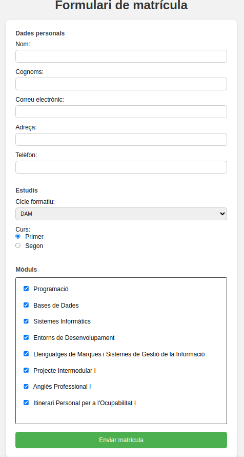

# Exercici. Matricula a l'IES

Anem a preparar el procediment per realitzar la matrícula on-line dels cicles formatius de DAM/DAW a l'institut.

Per a això, generarem una aplicació amb ExpressJS que contindrà un forulari HTML amb el qual recollirem les dades de matrícula. Aquestes dades s'enviaran al servidor, i aquest, a través de XSLT-FO generarà un document pdf que ens podrem descarregar des del navegador.

L'estructura del projecte serà la següent:

```text
backend/
    ├── exemple_matricula.xml
    ├── index.js                (codi principal del servidor)
    ├── matricula.pdf
    ├── node_modules
    ├── package.json
    ├── public
    │   ├── css
    │   │   └── index.css
    │   ├── index.html          (formulari de matricula)
    │   └── js
    │       └── index.js
    ├── uploads
    │   │   └── (per guardar fitxers temporals)
    └── xslt
        └── matricula.xsl  (XSLT → genera XSL-FO)
```

El formulari s'ubicarà a la carpeta `public` del backend, que és on solen ubicar-se les pàgines web que serveix el servidor (és a dir, el backend). Configurarem el servidor amb el middleware Static per a que servisca el contingut d'aquesta carpeta.

El funcionament seguirà els següents punts:

## Frontend (index.html)

Conté el formulari amb la matrícula. En ell es demanaran:

* **nom** de l'alumne (obligatori)
* **cognoms**, (obligatori)
* **dni** (obligatori)
* **email**, (oblligatori, i ben formatat)
* **adreça**,
* **telèfon**,
* **cicle** (desplegable amb les opcions mínimes DAM/DAW),
* **curs** (radiobuttons per triar entre 1r/2n)
* **llista de mòduls** del curs en el què es va a matricular, (serà una llista de checkboxes, un per mòdul).

Quan es prema el botó d'enviar el formulari, es realitzarà una petició POST al servidor amb la informació en format JSON.

## Backend (server.js)

El servidor:

* Rep les dades del formulari.
* Genera un XML amb la informació de la matrícula.
* Aplica XSLT per convertir-lo a XSL-FO.
* Converteix l'XSL-FO a PDF (fent una crida a Apache FOP via child_process).
* Envia el PDF al navegador perquè el descarregue.

## Exemples

A la carpeta `exemplesFitxers` disposeu de diferents exemples sobre els fitxers que caldrà generar.

## TO-DO

Al llarg del projecte, disposeu dels diferents TO-DOs que caldrà completar.

Per tal de provar les ordres xsltproc i fop, podeu fer-ho directament des de la terminal i provar els vostres fitxers de transformació, per assegurar-vos del seu correcte funcionament.

## Exemple de formulari complet


